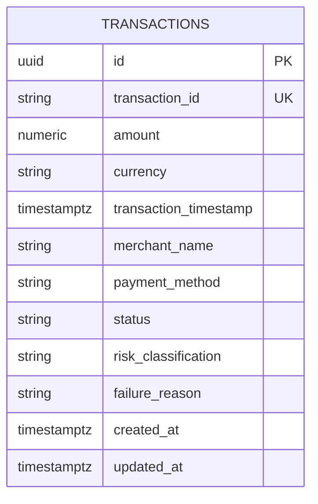

# PayGuard — ER Diagram

## Current MVP Data Model

Sprint 1 establishes the `transactions` entity. The model below intentionally reflects the implemented foundation.

## transactions

| Field | Purpose |
|---|---|
| id | Internal UUID |
| transaction_id | Business transaction identifier |
| amount | Transaction amount |
| currency | Currency code |
| transaction_timestamp | Event time |
| merchant_name | Merchant |
| payment_method | Payment channel/method |
| status | Successful, failed, pending, reversed |
| risk_classification | Normal or suspicious |
| failure_reason | Failure context |
| created_at | Record creation time |
| updated_at | Record update time |

## Mermaid ER Diagram



## Planned Domain Expansion

```text
Transaction
    |
    +-- Risk Signal
    |
    +-- Investigation
    |
    +-- AI Analysis
    |
    +-- Case
           |
           +-- Resolution
```

Future relationships should be defined when the corresponding requirements are refined.

## Design Principle
Do not create future tables merely because a feature is imagined. Evolve the data model as validated domain requirements emerge.
